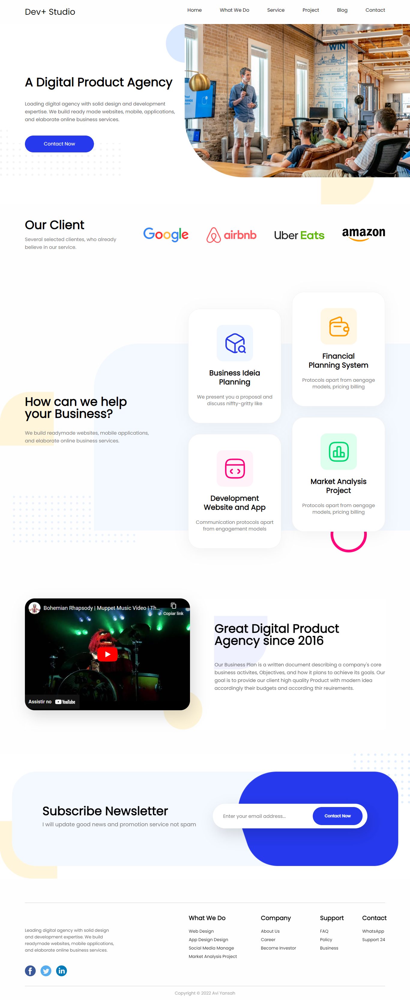

<h1 align="center" id="top">Desafio Landing Page Dev+ Studio</h1>

<h2>Sobre o desafio</h2>

O desafio era passar a landing page desenvolvida no Figma para o código.

<h2>Tecnologias e ferramentas</h2>

Tecnologias:
* HTML
* CSS

Ferramentas e libs:
* Figma
 
<h2>Links</h2>

* <a href="https://www.figma.com/file/rZ4I2u7Y6izV4aaV7T76WJ/Studio-Design-Landin-Page-(Community)?node-id=0%3A1&t=JFnWCBRhAxyo0M1X-1" target="_blank">Link do Figma</a>
* <a href="https://mere-tree.surge.sh/" target="_blank">Visualizar o projeto</a>

<h2>Versão para Desktop</h2>
 

